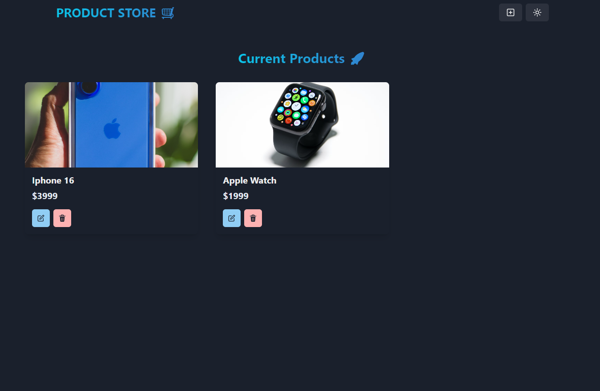

# Portfolio de projetos 


# Product Store

Este é um projeto de loja online desenvolvido com Node.js, MongoDB, Mongoose no backend e React com Chakra UI e Zustand no frontend.

## Tecnologias Utilizadas

### Backend
- **Node.js**: Ambiente de execução JavaScript no servidor
- **Express.js**: Framework web para Node.js
- **MongoDB**: Banco de dados NoSQL
- **Mongoose**: ORM para MongoDB

### Frontend
- **React.js**: Biblioteca para construção de interfaces
- **Chakra UI**: Biblioteca de componentes estilizados
- **Zustand**: Gerenciador de estado simples e eficiente

## Instalação e Configuração

### Backend
1. Clone o repositório:
   ```sh
   cd product-store/backend
   ```
2. Instale as dependências:
   ```sh
   npm install
   ```
3. Configure as variáveis de ambiente no arquivo `.env`:
   ```env
   PORT=5000
   MONGO_URI=sua_string_de_conexao_mongodb
   ```
4. Inicie o servidor:
   ```sh
   npm start
   ```

### Frontend
1. Navegue até a pasta do frontend:
   ```sh
   cd ../frontend
   ```
2. Instale as dependências:
   ```sh
   npm install
   ```
3. Inicie o aplicativo:
   ```sh
   npm start
   ```

## Estrutura do Projeto
```
product-store/
├── backend/
│   ├── models/
│   ├── routes/
│   ├── controllers/
│   ├── config/
│   ├── server.js
│   ├── .env
│
├── frontend/
│   ├── src/
│   │   ├── components/
│   │   ├── pages/
│   │   ├── store/
│   │   ├── App.js
│   │   ├── index.js
│
├── README.md
```


